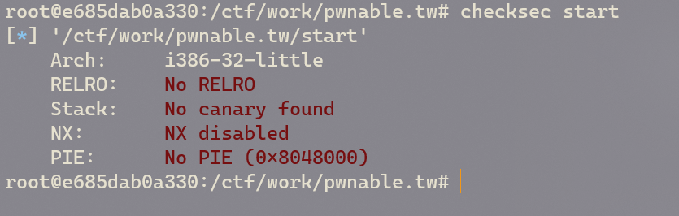

# Pwnable.tw writeup

### Start

#### checksec

<figure><figcaption></figcaption></figure>

没开任何保护

#### file

<figure><figcaption></figcaption></figure>

32位静态链接

#### IDA Pro

<figure><figcaption></figcaption></figure>

很简单的函数，只有`_start`

```armasm
08048060 <_start>:
 8048060:       54                      push   %esp
 8048061:       68 9d 80 04 08          push   $0x804809d   
 8048066:       31 c0                   xor    %eax,%eax    ;寄存器清零
 8048068:       31 db                   xor    %ebx,%ebx
 804806a:       31 c9                   xor    %ecx,%ecx
 804806c:       31 d2                   xor    %edx,%edx
 804806e:       68 43 54 46 3a          push   $0x3a465443  ; 'CTF:'
 8048073:       68 74 68 65 20          push   $0x20656874  ; 'the '
 8048078:       68 61 72 74 20          push   $0x20747261  ; 'art '
 804807d:       68 73 20 73 74          push   $0x74732073  ; 's st'
 8048082:       68 4c 65 74 27          push   $0x2774654c  ; "Let'"
 8048087:       89 e1                   mov    %esp,%ecx
 8048089:       b2 14                   mov    $0x14,%dl
 804808b:       b3 01                   mov    $0x1,%bl
 804808d:       b0 04                   mov    $0x4,%al
 804808f:       cd 80                   int    $0x80        ; write(1,str,0x14)
 8048091:       31 db                   xor    %ebx,%ebx    ; 清零
 8048093:       b2 3c                   mov    $0x3c,%dl
 8048095:       b0 03                   mov    $0x3,%al
 8048097:       cd 80                   int    $0x80        ; read(0,str,0x3c)
 8048099:       83 c4 14                add    $0x14,%esp   ; 抬高栈顶返回到exit
 804809c:       c3                      ret
```

这段汇编的意思就是：向屏幕上打印“Let's start the CTF:”，然后读入屏幕输入

汇编级别的系统调用可以在这里查到



可以看到read读入了60个字节的数据
